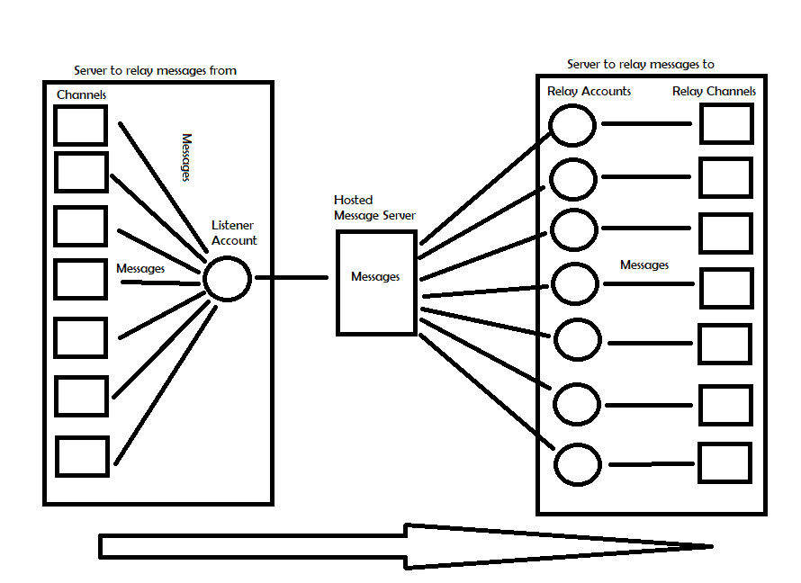

# discord-relay
#### Description: ####
Node.js program to relay messages from one discord server (can scrape messages from all channels) to another server using bot accounts.

#### Sample Use: ####
You want to join a crypto Discord server that charges for access, you can pay for one account to be in the server and relay all information to your own server, and charge access accordingly.  As the listener account is a normal human discord account (read: not a bot), there is no way for the server owners to detect that messages are being scraped from the server. 

**Note:**  At minimum for this program to work you need ***two unique Discord Accounts***.  The program in this repository is a simplified version of my original program, and I have personally built up this program to have one listener account and ***14*** relayer accounts.  This is incredibly easy to build off of, and please contact me if there are any issues or questions.

#### Software Requirements: ####
1. Node.js v8.11.x
2. npm v6.1.x
3. discord.js (first time use)
4. pm2 manager(first time use, optional)

#### Account Setup and Channel Requirements: ####
1. Listener account token (can be bot or human account, use human at your own risk, technincally bannable but I've had no issues)
2. Relayer account token (should usually be a bot account)
3. Channel you want to relay messages *from*
4. Channel you want to relay messages *to*

A solid tutorial to bot accounts: https://twentysix26.github.io/Red-Docs/red_guide_bot_accounts/

All information about keys and channel ID's can be googled easily.

Both account tokens will be 59 character strings, that look like "NDY0xxxxxxxxxxxxxxxxxxxxxxxxxxxxxxxxxxxxxxxxxxxxxxxxxxxxxxx".

The channel ID will be an 18 digit string that looks like "42xxxxxxxxxxxxxxxx".

#### First time use: ####
To install discord.js and pm2, first check that node.js and npm are installed.  This is achieved with opening a terminal and entering 'node -v' and 'npm -v' respectively.  If available, installed versions will appear for both.  cd to your project folder (in my case called discord-relay) and enter 'npm install discord.js', and 'npm install pm2 -g'.  The packaged "discord.js" is required, pm2 will keep the bots alive in the event of an unexpected internet loss or unforeseen issue, to prevent downtime.  

  Once both are installed, verify that you have both relay.js and config.json.  relay.js is the driver code, config.json has all of the account tokens for each bot, as well as channel id's for each relayed channel.  To run the code, open a terminal, cd to the project folder and enter 'node relay.js'.  To verify that all bots are online and ready, the program will output a ready notification for each bot (depending on how many you have added). After that, every time the 'slave' account receives a message in one of the relayed channels, a line indicating what channel the message is going to is printed.  ctrl+c to kill the bots if needed.  

  Now, to run pm2 on the relay, stay in the project file and type 'pm2 start relay.js'.  To kill the program, type 'pm2 delete relay'.  To show logs, type 'pm2 show logs relay', and to monitor ram usage, and logs, as well as restarts and other info, type 'pm2 monit relay'.  Once the app is running on pm2, there should be no interruptions other than fatal errors (I don't expect there to be).
